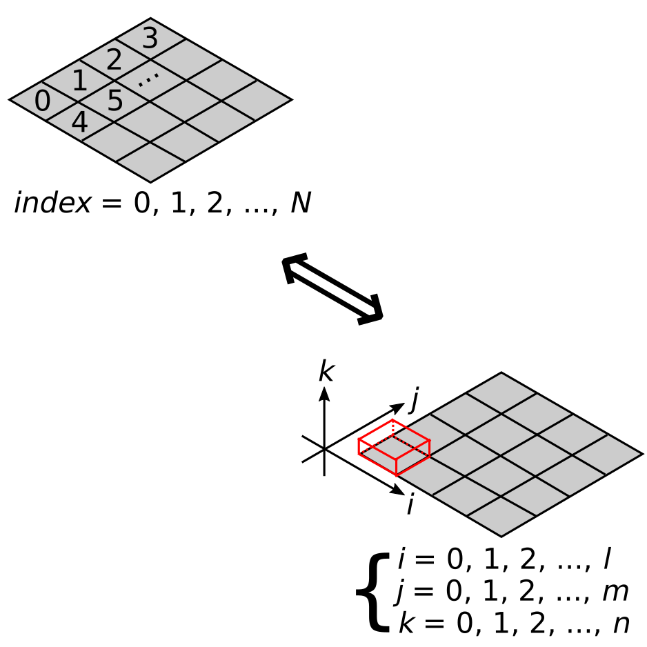

# nDRandom
Tool that outputs a random coordinates generater in n-th dimensions  
GitHub: https://github.com/YujiSODE/nDRandom  
>Copyright (c) 2020 Yuji SODE \<yuji.sode@gmail.com\>  
>This software is released under the MIT License.  
>See LICENSE or http://opensource.org/licenses/mit-license.php  
______
## 1. Description
`nDRandom` is a tool that outputs a random coordinates generater in n-th dimensions.

## 2. Concept

## 3. [Algorithm](algorithm.md)
To obtain random coordinates from a given space in `n`-th dimensions.  
Let variable elements be _`E`_`= (`_`e`_`0``,`_`e`_`1``,...,`_`e`_*`n`*`)` where _`i`_`=0,...,`_`n`_.  
A range of a variable element `e`_`i`_ is divided into _`d`__`i`_ intervals.  
Let indices correspond to a specified intervals in divided elements as follows:  
_`IDX`_`=(`_`IDX`_`0``,`_`IDX`_`1``,...,`_`IDX`_*`n`*`)`.  
  
A coordinate element value can be estimated as follows:  
_`e`_*`j`*`=`_`x`_`0``+`_`m`_*`j`*`*`_`dx`_,  
where _`m`_*`j`* is constant,  
_`x`_`0``=`_`e`_*`j`*`[`_`IDX`_*`j`*`]`  
and _`dx`_`=(`_`e`_*`j`*`max``-`_`e`_*`j`*`min``)/`_`d`_*`j`*.

## 4. Scripts
- [`nDRandom.tcl`](nDRandom.tcl): main script
- [`ndrandomOutput_tcl.tcl`](ndrandomOutput_tcl.tcl): module to output as Tcl file
